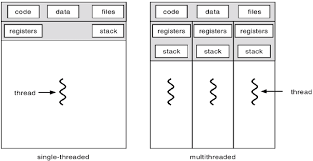

## 스레드란?
>프로세스를 만들면 스로세스 간에는  각 프로세스의 데이터 접근이 불가하다.
>그래서 나온것이 스레드

- 스레드는 하나의 프로세스 안에서 동작한다.
- 하나의 프로세스에 여러개의 스레드 생성 가능
- 스레드들은 동시에 실행이 가능하다.
- 프로세스 안에 있으므로 프로세스의 데이터를 모두 접근 가능하다.

Thread는 각기 실행 가능한 스택이 존재하고 나머지는 공유한다.

성능을 개선하기 위해서 멀티스레드를 많이 사용한다.
최근 CPU는 멀티 코어를 가지므로 쓰레드를 여러개 만들어 멀티 코어를 활용도를 높임
- 코어가 여러개 있는것은 스레드를 각각의 코어에 넣어서 동시에 실행할수 있기 때문에 제공

최근에는  짧은 반응 시간이 우선이기 때문에 성능 개선에 신경을 많이 쓰므로
멀티 프로세스 또는 멀티 쓰레드를 고려한다.

멀티  프로세스보다 스레드를 자연스럽게 더 많이 사용함
 - 멀티 프로세스는 처음 구조를 잡을 때 만들어야 하지만
 - 쓰레드는 프로그램의 일부 동작에서만 사용하도록 일부 코드 수정으로 가능하기 때

