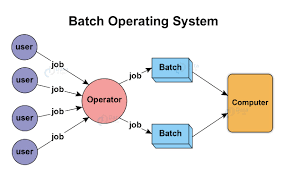
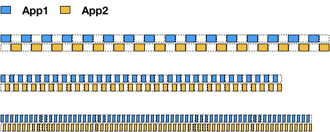

## 프로세스란?
- 실행중인 프로그램을 프로세스라고 한다.
  - 프로세스 : 메모리에 올려져서 실행중인 프로그램
  - 코드 이미지(바이너리): 실행파일
- 응용프로그램 != 프로세스
  - 응용프로그램은 여러 프로세스로 구성 가능하다
> 프로세스를 언제 실행 시킬것이냐와 관련 된 운영체제 기능을 프로세스 스케줄링 기능이라고한다.

---
## 배치처리 시스템(Queue 자료구조)
> 맨 처음에 운영체제가 나왔을때 스케줄링 알고리즘으로 채택했던 알고리즘이 배치처리 시스템이다.

- 여러 프로그램은 실행이 너무 시간이 많이 걸려서 다른 프로그램이 실행하는데 시간을 많이 기다려야 한다.
  - 어떤 프로세스를 실행시키면 그 프로세스가 끝날때까지는 실행이 안된다.
- 이런 불편함을 없애기 위해 스케줄링 기능이 나왔다.
#### 배치 처리 시스템 스케줄링 실행과정
1. 실행해야 하는 프로세스를 미리 등록을 시켜 놓는다.
2. 맨 처음에 등록시킨 프로세스부터 순차적으로 실행 된다.
3. 프로세스가 끝나면 자동으로 미리 등록된 프로세스를 운영체제가 실행시킨다.
---
## 시분할 시스템
- 다중 사용자 지원을 위해 컴퓨터 응답시간을 최소화 하는 시스템
  - 여러 사용자가 동시에 하나의 컴퓨터를 쓰려면 어떻게 해ㅐ야 할까?(다중 사용자 지원)
#### 동작 방식
- 응용프로그램이 cpu를 점유하는 시간을 잘게 쪼개어 실행될수 있도록 한다.
- 시간을 잘게 쪼개서 프로세스1을 시키고 그다음에 바꿔서 프로세스 2를 행시킨다(반복)
> 옛날에는 컴퓨터가 비쌌기 때문에 여러 사람이 한대의 컴퓨터를 사용할수 있도록 운영체제의 시분할 시스템의 수요가 많았다.

---
## 멀티 태스킹
- 단일 CPU에서 여러 응용프로그램이 실행되는 것처럼 보이도록 하는 시스템

    
  - 음악을 들으며, 문서작성을 한다.
  - 10~20ms 단위로 실행 응용 프로그램이 바뀜
    - 20ms는 사람이 인지하기 어려운 시간이라 동시에 실행되는것처럼 보임
  - 알고리즘 구현은 시분할 시스템과 동일하고, 목표만 다르다.
  - 보기엔 쉬워보이지만 실제로 구현은 굉장히 어렵다.
---

## 프로세스 구조
프로세스는 일반적으로 4가지 구성요소로 이루어져서 메모리에 올라가게 된다
1. text(CODE): 코드
2. data: 코드에서 선언한 변수/ 초기화된 데이터
3. stack: 임시 데이터 (함수호출, 로컬변수 등)
4. heap : 코드에서 동적으로 만들어지는 데이터
   - 프로그램이 실행되면서 만들어지는 객체나 데이터들은 heap공간에 할당된다.

## 어떻게 동작하는지 알아보자
- 프로세스와 컴퓨터 구조
  - PC(ProgramCounter) + SP(Stack Pointer)
    - PC: 다음 실행할 코드 주소
    - SP: 스택 최상단 주소
  - 임베디드 시스템 등에서 동작하는 C 프로그램들은 디버깅시 PC와 SP를 캠쳐해서 확인

