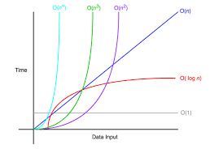

## 빅오(O) 표기법
> 알고리즘의 성능을 분석할 때 사용하는 수학적 표현 방식이다
> 알고리즘이 처리해야 할 데이터의 양이 증가할 때 그 알고리즘이 얼마나 빠르게 실행되는지 나타낸다.
> 여기서 중요한것은 알고리즘의 정확한 실행시간을 계산하는것이 아니라 데이터 양의 증가에 따른 성능의 변화 추세를 이해하는 것이다.

### 빅오 표기법의 예시
- O(1) : 한번만에 연산이 끝나버린다.(가장 이상적인 알고리즘)
  - 상수시간: 데이터의 크기에 관계없이 알고리즘의 실행시간이 일정하다.
    - 예) 배열에서 인덱스를 사용한느 경우
- O(n) : 데이터의 크기가 커지는 만큼 연산수도 커진다.
  - 선형시간: 알고리즘의  실행시간이 입력데이터의 크기에 비례하여 증가한다.
    - 예) 배열의 검색, 배열의 모든 요소를 순회하는 경우
- O( n2) : 제곱시간 : 알고리즘의 실행시간이 입력 데이터의 크기에 제곱에 비례하여 증가한다(최악의 알고리즘)
  - n2은 n * 이다.
  - 예) 보통 for문 두번 돌리는 알고리즘에서 많이 나타난다.

- O(log n) : 알고리즘 실행시간이 데이터 크기의 로그에 비례하여 증가한다.
  - 예) 이진탐색

- O(n log n) - 선형 로그 시간:
  - 예) 많은 효율을 가진 정렬 알고리즘들

> 빅오 표기법은 매우 큰 데이터를 입력한다고 가정하고, 데이터 양 증가에 따른 성능의 변화를 비교하는데 사용한다.
> 쉽게 이야기 해서  정확한 성능을 측정하는것이 아니라 대력적인 성능의 변화추세를 보는 것이다.
> 따라서 데이터가 매우 많이 들어오면 추세를 보는데 상수는 크게 의미가 없어진다.
> 이런 이유로 빅요 표기법에서는 상수를 제거한다.
> 예를 들으 O(n+2), O(n/2) 모두 O(n)으로 표시한다

 

